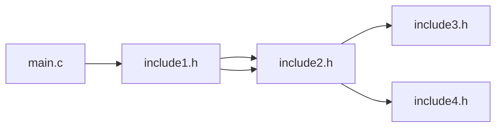

<a id='jcbrill-c01-top'></a>

The intent of this post is to document some of the existing issues and limitations of the *CConditionalScanner*, and to a lesser extent, the *CScanner*.

***Please report any erroneous assumptions, interpretations, and conclusions.***

Table of Contents:
* [1. Introduction](#jcbrill-c01-1)
* [2. Research Repository](#jcbrill-c01-2)
* [3. SCons Scanner Issues](#jcbrill-c01-3)
* [4. SCons Scanner Limitations](#jcbrill-c01-4)
* [5. Custom Compiler Preprocessor Scanners](#jcbrill-c01-5)
* [6. File Inclusion Search Paths](#jcbrill-c01-6)
* [7. Discussion](#jcbrill-c01-7)
* [A. Known Issues Addendum](#jcbrill-c01-a)
* [B. Revisions Addendum](#jcbrill-c01-b)

<a id='jcbrill-c01-1'></a>
## 1. Introduction

The content presented is based on insights and results derived from a series of examples and tests.

[Section 2](#jcbrill-c01-2) provides repository links for the source code and scripts used for the examples and tests.

[Section 3](#jcbrill-c01-3) documents some of the issues identified with the SCons C scanners.

[Section 4](#jcbrill-c01-4) documents some of the limitations of the SCons C scanners.

[Section 5](#jcbrill-c01-5) contains a discussion of results from the custom compiler preprocessor scanners.

[Section 6](#jcbrill-c01-6) contains documentation of the file inclusion search paths from the c and c++ standards and the MSVC and GNU compilers.

[Section 7](#jcbrill-c01-7) contains a discussion of the research presented.

[Addendum A](#jcbrill-c01-a) contains additional known issues for the SCons C scanners.

[Addendum B](#jcbrill-c01-b) contains the revision history for this document.


<a id='jcbrill-c01-2'></a>
## 2. Research Repository

Subsection map:
* [2.1 External Library](#jcbrill-c01-2-1)
  * [2.1.1 Platform Split/Quote Command-Line Arguments](#jcbrill-c01-2-1-1)
* [2.2 Custom Scanners](#jcbrill-c01-2-2)
  * [2.2.1 GCCPreProcessorScanner](#jcbrill-c01-2-2-1)
  * [2.2.2 MSVCPreProcessorScanner](#jcbrill-c01-2-2-2)
  * [2.2.3 CConditionalModScanner](#jcbrill-c01-2-2-3)

The research repository is available at: https://github.com/jcbrill/scons-prototypes/tree/main/scons/scons-issue-4656.

Almost all of the test examples and scripts assume that:
* *Both* the *MSVC* compiler and the *MinGW-w64* (i.e., the *gcc* executable) compiler are present on Windows.
* The *GNU* compiler (i.e., the *gcc* executable) is available on other platforms.

The non-windows scripts were run in WSL on Windows.  The author has limited experience on non-windows platforms so the bash scripts are likely cringe-inducing for non-windows users.

The primary test environments employed for this document are:
* Windows 10:
  * gcc 11.2.0 (mingw-w64)
  * msvc 14.42.34433 (vs2022 community)
  * python 3.7.9 (embedded)
* Windows 10 WSL2 (Ubuntu 22.04):
  * gcc 11.4.0
  * python 3.10.12

<a id='jcbrill-c01-2-1'></a>
### 2.1 External Library

The external library is a limited subset of the author's research and reference library for msvc detection.

Folder layout:
```txt
 site-scons
 ├─ mswindev
    ├─ __init__.py
    ├─ pyargs.py
    └─ pyinfo.py
```

*pyinfo.py* is a minimal *shim* in order for *pyargs.py* to work in isolation for the research repository.

<a id='jcbrill-c01-2-1-1'></a>
#### 2.1.1 Platform Split/Quote Command-Line Arguments

Source file: [*site-scons/mswindev/pyargs.py*](https://github.com/jcbrill/scons-prototypes/blob/main/scons/scons-issue-4656/site-scons/mswindev/pyargs.py)

*pyargs.py* exports the following functions:
* *platform\_split\_args*: Platform specific function to split a string into a list of arguments.
* *platform\_quote\_arg*: Platform specific function to quote an argument.
* *platform\_quote\_args*: Platform specific function to quote each element of a list of arguments.
* *platform\_join\_args*: Platform specific function to quote each element of a list of arguments and join all quoted arguments.

The three (3) platforms supported are:
* Windows (i.e., `sys.platform.startswith("win")`)
* Posix (i.e., `os.name == "posix"`)
* Non-Posix

There is a known issue with the SCons splitting of command-line arguments containing quoted strings with embedded spaces.

<a id='jcbrill-c01-2-2'></a>
### 2.2 Custom Scanners

Three custom scanners were developed as part of the research effort.

```txt
 site-scons
 ├─ ppscanner
    ├─ __init__.py
    ├─ _common.py
    ├─ _preprocess.py
    ├─ gcc.py
    ├─ msvc.py
    └─ scons.py
```

<a id='jcbrill-c01-2-2-1'></a>
#### 2.2.1 GCCPreProcessorScanner

Source files:
* [*site-scons/ppscanner/_common.py*](https://github.com/jcbrill/scons-prototypes/blob/main/scons/scons-issue-4656/site-scons/ppscanner/_common.py).
* [*site-scons/ppscanner/gcc.py*](https://github.com/jcbrill/scons-prototypes/blob/main/scons/scons-issue-4656/site-scons/ppscanner/gcc.py).

*Disclaimers*:
* The *GCCPreProcessorScanner* is as ***proof-of-concept*** implementation that likely contains bugs.
* The *GCCPreProcessorScanner* has not been tested on "real-world" code bases.

The *GCCPreProcessorScanner* parses the output produced by the gcc compiler preprocessor for include dependencies.

System include file detection is based on the optional flags present in the line directive output.  Errors are possible based on the author's understanding of the meaning attached to the line directive flag values.

<a id='jcbrill-c01-2-2-2'></a>
#### 2.2.2 MSVCPreProcessorScanner

Source files:
* [*site-scons/ppscanner/_common.py*](https://github.com/jcbrill/scons-prototypes/blob/main/scons/scons-issue-4656/site-scons/ppscanner/_common.py).
* [*site-scons/ppscanner/msvc.py*](https://github.com/jcbrill/scons-prototypes/blob/main/scons/scons-issue-4656/site-scons/ppscanner/msvc.py).

*Disclaimers*:
* The *MSVCPreProcessorScanner* is as ***proof-of-concept*** implementation that likely contains bugs.
* The *MSVCPreProcessorScanner* contains a ***path classification heuristic*** that is likely incomplete and possibly erroneous.
* The *MSVCPreProcessorScanner* has not been tested on "real-world" code bases.

The *MSVCPreProcessorScanner* parses the output produced by the msvc compiler preprocessor for include dependencies.

A path classification heuristic is employed for system include file detection when processing the msvc preprocessor output.  The path classification heuristic is incomplete and should be revisited.

<a id='jcbrill-c01-2-2-3'></a>
#### 2.2.3 CConditionalModScanner

Source files:
* [*site-scons/ppscanner/_preprocess.py*](https://github.com/jcbrill/scons-prototypes/blob/main/scons/scons-issue-4656/site-scons/ppscanner/_preprocess.py).
* [*site-scons/ppscanner/scons.py*](https://github.com/jcbrill/scons-prototypes/blob/main/scons/scons-issue-4656/site-scons/ppscanner/scons.py).

The *CConditionalModScanner* is implemented by subclassing *SConsCPPConditionalScanner* and *SConsCPPConditionalScannerWrapper* and overriding a limited set of methods to address some, but not all, of the issues presented in [Section 3](#jcbrill-c01-3) with the *CConditionalScanner*.


<a id='jcbrill-c01-3'></a>
## 3. SCons Scanner Issues

Subsection map:
* [3.1 CConditionalScanner Recursion](#jcbrill-c01-3-1)
* [3.2 PreProcessor File Inclusion](#jcbrill-c01-3-2)
* [3.3 CConditionalScanner Alternate Search Paths](#jcbrill-c01-3-3)
* [3.4 Angle Bracket Include Search Path](#jcbrill-c01-3-4)
  * [3.4.1 CConditionalScanner Extended Example](#jcbrill-c01-3-4-1)
* [3.5 Text Transformations Prior to Scanning](#jcbrill-c01-3-5)

<a id='jcbrill-c01-3-1'></a>
### 3.1 CConditionalScanner Recursion

For recursive scanners (e.g., *CScanner*), the dependencies list produced when invoking the scanner *scan* function directly and the dependencies list produced by SCons execution via *get_implicit_dependencies* may not be the same.

https://github.com/SCons/scons/blob/144af4aa23cf1a40467f154b38de1e88eee14d93/SCons/Node/__init__.py#L978-L1011

**Line 1009** calls the `recurse_nodes` method.  All nodes returned will be scanned, hence the recursion.

https://github.com/SCons/scons/blob/144af4aa23cf1a40467f154b38de1e88eee14d93/SCons/Scanner/C.py#L283-L316

**Lines 312-313** contain the `recurse_nodes` method implementation.

*However, for scanner implementations that automatically recurse through discovered dependencies (e.g., *CConditionalScanner*), the `recurse_nodes` method should return an empty list.*

Folder layout:
```txt
 RecurseTest
 ├─ include
 │  ├─ include
 │  │  └─ recurse2.h
 │  └─ recurse1.h
 ├─ SConstruct
 └─ main.c
```

*SConstruct*:
```py
from sconstruct_common import scanner_configuration

DefaultEnvironment(tools=[])

scanner_cfg = scanner_configuration()

env = Environment(
    tools = scanner_cfg.tools,
)

sourcefile = "main.c"

if scanner_cfg.scanner_dependencies:
    scanner_cfg.dependencies(sourcefile, env)
else:
    env.Program(sourcefile)
```

*main.c*:
```c
#define SKIP_INCLUDE2

#include "include/recurse1.h"

int main(void);
int main(void) {}
```

*include/recurse1.h*:
```c
#ifndef RECURSE1_H
#define RECURSE1_H

// #pragma message("recurse1.h")

#ifndef SKIP_INCLUDE2
#include "include/recurse2.h"
#endif

#endif
```

*include/include/recurse2.h*:
```c
#ifndef RECURSE2_H
#define RECURSE2_H

// #pragma message("recurse2.h")

#endif
```

*CConditionalScanner*:
* calling the scan method directly: `['include/recurse1.h']`
* calling the scan method recursively: `['include/recurse1.h', 'include/include/recurse2.h']`

The SCons produced tree using *CConditionalScanner* is:
```
gcc -o main.o -c main.c
gcc -o main main.o
+-.
  +-SConstruct
  +-include
  | +-include/include
  | | +-include/include/recurse2.h
  | +-include/recurse1.h
  +-main
  | +-main.o
  | | +-main.c
  | | +-include/recurse1.h
  | | +-include/include/recurse2.h
  | | +-/bin/gcc
  | +-/bin/gcc
  +-main.c
  +-main.o
    +-main.c
    +-include/recurse1.h
    +-include/include/recurse2.h
    +-/bin/gcc
```

The *SConsCPPConditionalScannerWrapper* *\_\_call\_\_* method (**Lines 297-310**) creates a new *SConsCPPConditionalScanner* object for **each** source file scanned.

When file *include/recurse1.h* is scanned again due to being returned in the *recurse_nodes* list, all caller definitions produced in the source code (e.g., `#define SKIP_INCLUDE2` in `main.c`) are unknown/undefined causing different files to be included when scanned in isolation rather than in the context of the call chain.

As the *CConditionalSCanner* implementation is already recursive, the wrapper implementation of `recurse_nodes` should return an empty list:
```py
    def recurse_nodes(self, nodes):
        return []
```

Scanner dependencies:
* *GCCPreProcessorScanner*: `['include/recurse1.h']`
* *MSVCPreProcessorScanner*: ` ['include/recurse1.h']`
* *CConditionalModScanner*: `['include/recurse1.h']`
* *CConditionalScanner*: `['include/recurse1.h', 'include/include/recurse2.h']`
* *CScanner*: `['include/recurse1.h', 'include/include/recurse2.h']`


<a id='jcbrill-c01-3-2'></a>
### 3.2 PreProcessor File Inclusion

There are issues with the include processing in the `do_include` method of the *cpp.Preprocessor* class which also affects the *CConditionalScanner*.

https://github.com/SCons/scons/blob/144af4aa23cf1a40467f154b38de1e88eee14d93/SCons/cpp.py#L583-L587

Include file handling issues:
1. A file can legitimately be included more than once.  Include guards can be employed if the *contents* should only be included once. As demonstrated below, including a file multiple times may yield additional dependencies.
2. A global list is employed that gathers files while walking the tree to prevent infinite recursion.  This can erroneously prune branches from the search tree.  I believe that the recursion detection should only take into account the trail from the root to the current include file.  Detection of of a loop should only consider whether the included file exists in the ancestor path from the root (i.e., there is a loop in the *trail* to the current file).
3. ***Fixing the multiple include (Item 1) and recursion detection (Item 2) issues may lead to erroneous include file handling when `#pragma once` (non-standard, but widely implemented) is employed instead of header guards (standard). Item 1 is effectively treating every file as if it includes header guards or `#pragma once`; this means that a file with `#pragma once` is currently working as expected for the wrong reason. The behavior of `#pragma once` is implementation defined.***

Folder layout:
```txt
 MultipleTest
 ├─ include
 │  ├─ include1.h
 │  ├─ include2.h
 │  ├─ include3.h
 │  └─ include4.h
 ├─ SConstruct
 └─ main.c
```

*SConstruct*:
```py
from sconstruct_common import scanner_configuration

DefaultEnvironment(tools=[])

scanner_cfg = scanner_configuration()

env = Environment(
    tools = scanner_cfg.tools,
)

sourcefile = "main.c"

if scanner_cfg.scanner_dependencies:
    scanner_cfg.dependencies(sourcefile, env)
else:
    env.Program(sourcefile)
```

*main.c*:
```c
#include "include/include1.h"

int main(void);
int main(void) {}

````

*include/include1.h*:
```
#ifndef INCLUDE1_H
#define INCLUDE1_H
/* #pragma message("include1.h") */

#define PATH_1
#include "include2.h"
#undef PATH_1

#define PATH_2
#include "include2.h"
#undef PATH_2

#endif
```

*include/include2.h*:
```
/* #pragma message("include2.h") */

#ifdef PATH_1
#include "include3.h"
#endif

#ifdef PATH_2
#include "include4.h"
#endif
```

*include/include3.h*:
```
#ifndef INCLUDE3_H
#define INCLUDE3_H
/* #pragma message("include3.h") */
#endif
```

*include/include4.h*:
```
#ifndef INCLUDE4_H
#define INCLUDE4_H
/* #pragma message("include4.h") */
#endif
```

File *include/heade2.h* intentionally does not have include guards and is expected to be included more than once.

Graphical representation of the source tree:


Expected include processing trails from the root file to all leaf files:
```
Trail 1: (main.c, include1.h, include2.h, include3.h)
Trail 2: (main.c, include1.h, include2.h, include4.h)
```

Scanner dependencies:
* *GCCPreProcessorScanner*: `['include/include1.h', 'include/include2.h', 'include/include3.h', 'include/include4.h']`
* *MSVCPreProcessorScanner*: `['include/include1.h', 'include/include2.h', 'include/include3.h', 'include/include4.h']`
* *CConditionalModScanner*: `['include/include1.h', 'include/include2.h', 'include/include3.h']`
* *CConditionalScanner*: `['include/include1.h', 'include/include2.h', 'include/include3.h']`
* *CScanner*: `['include/include1.h', 'include/include2.h', 'include/include3.h', 'include/include4.h']`

*CConditionalScannerMod* and *CConditionalScanner* result list sequence:
```
'include/include1.h' not in [] -> append
'include/include2.h' not in ['include/include1.h'] -> append
'include/include3.h' not in ['include/include1.h', 'include/include2.h'] -> append
'include/include2.h' in ['include/include1.h', 'include/include2.h', 'include/include3.h'] -> skip
```

<a id='jcbrill-c01-3-3'></a>
### 3.3 CConditionalScanner Alternate Search Paths

Include file search path notes:
* The quote and angle bracket include file search paths are *implementation dependent*.
* The quote include file search paths are *different* for the MSVC and mingw-w64/gnu compilers.

Code fragments:

1. *C.SConsCPPConditionalScanner.\_\_init\_\_*

   <!--- C.SConsCPPConditionalScanner.__init__ -->
   https://github.com/SCons/scons/blob/144af4aa23cf1a40467f154b38de1e88eee14d93/SCons/Scanner/C.py#L251-L254

2. *C.SConsCPPConditionalScanner.find\_include\_file*

   <!--- C.SConsCPPConditionalScanner.find_include_file -->
   https://github.com/SCons/scons/blob/144af4aa23cf1a40467f154b38de1e88eee14d93/SCons/Scanner/C.py#L259-L273

Issues:

1. The CConditionalScanner list variable `_known_paths` is populated during tree walk and subverts the search order rules as the known paths list precedes the cpp search paths list.  Due to the fact that the list is "global" and constructed during the tree walk and the known paths are searched first, the dependencies found by the *CConditionalScanner* can be different than the dependencies found by the compiler.

2. The test on line 268 test is very likely incorrect.  The *startswith* test is using a directory without a trailing separator against a filename.  Without the separator, the final path directory component is effectively a string that will match any directory name of which it is a proper prefix.  For example, given a directory `C:/path-a/path-b/path-c` and a file `C:/path-a/path-b/path-cdefgh/file.c`, the file name starts with the directory but the file is not actually on the path specified by the test directory.

The `_known_paths` implementation *appears* to be a form of *Most-Recently-Used* caching.  However, due to the construction of the known files list over the entire tree (i.e., a "global" variable) and the fact that there may be multiple target files with the same name in the search tree, this approach should not be employed.  Depending on the configuration, the known paths list can grow longer than the actual cpp search path causing more, possibly unnecessary, comparisons.

Folder layout:
```txt
 KnownIncl
 └─ include
    ├─ include1.h
    ├─ include2.h
    ├─ include3.h
    └─ include4.h

 KnownTest
 ├─ include
 │  ├─ include2.h
 │  └─ include4.h
 ├─ SConstruct
 └─ main.c
```

*KnownTest/SConstruct*:
```py
from sconstruct_common import scanner_configuration

DefaultEnvironment(tools=[])

scanner_cfg = scanner_configuration()

env = Environment(
    tools = scanner_cfg.tools,
    CPPPATH = ['./include', '../KnownIncl/include'],
)

sourcefile = "main.c"

if scanner_cfg.scanner_dependencies:
    scanner_cfg.dependencies(sourcefile, env)
else:
    env.Program(sourcefile)
```

*KnownTest/main.c*:
```c
#include <include1.h>
#include <include2.h>

#include "include3.h"
#include "include4.h"

int main(void);
int main(void) {}
```

*Note: the header files (e.g., *include1.h*) are not shown as they effectively contain include guards only.*

Scanner dependencies:
* *GCCPreProcessorScanner*:
  ```py
  [ '../KnownIncl/include/include1.h', 'include/include2.h',
    '../KnownIncl/include/include3.h', 'include/include4.h']
  ```
* *MSVCPreProcessorScanner*:
  ```py
  [ '../KnownIncl/include/include1.h', 'include/include2.h',
    '../KnownIncl/include/include3.h', 'include/include4.h']
  ```
* *CConditionalModScanner*:
  ```py
  [ '..\\KnownIncl/include/include1.h', 'include/include2.h',
    '..\\KnownIncl/include/include3.h', 'include/include4.h']
  ```
* *CConditionalScanner*:
  ```py
  [ '../KnownIncl/include/include1.h', '../KnownIncl/include/include2.h',
    '../KnownIncl/include/include3.h', '../KnownIncl/include/include4.h']
  ```
* *CScanner*:
  ```py
  [ '..\\KnownIncl/include/include3.h', 'include/include4.h',
    '..\\KnownIncl/include/include1.h', 'include/include2.h']
  ```

<a id='jcbrill-c01-3-4'></a>
### 3.4 Angle Bracket Include Search Path

Include file search path notes:
* The quote and angle bracket include file search paths are *implementation dependent*.

Modern msvc, mingw-w64, and gnu compilers do not appear to include the directory of the *source file* in the angle bracket search path by default.

Code fragments:

1. *C.ClassicCPP.find_include*
   
   <!--- C.ClassicCPP.find_include -->
   https://github.com/SCons/scons/blob/144af4aa23cf1a40467f154b38de1e88eee14d93/SCons/Scanner/__init__.py#L418-L428

2. *cpp.PreProcessor.\_\_init\_\_*

   <!--- cpp.PreProcessor.__init__ -->
   https://github.com/SCons/scons/blob/144af4aa23cf1a40467f154b38de1e88eee14d93/SCons/cpp.py#L246-L257

Scanner inclusion of the *source file* directory in the angle bracket search path:
* *CScanner*: **line 424** of code fragment 1,
* *CConditionalScanner* **line 256** of code fragment 2.

Folder layout:
```txt
 AngleBracketTest
 ├─ SConstruct
 ├─ anglebracket.h
 ├─ limits.h
 └─ main.c
```

*SConstruct*:
```py
from sconstruct_common import scanner_configuration

DefaultEnvironment(tools=[])

scanner_cfg = scanner_configuration()

env = Environment(
    tools = scanner_cfg.tools,
)

sourcefile = "main.c"

if scanner_cfg.scanner_dependencies:
    scanner_cfg.dependencies(sourcefile, env)
else:
    env.Program(sourcefile)
```

*main.c*:
```c
#include <limits.h>
#include <anglebracket.h>

int main(void);
int main(void) {}
```

Notes:
* The msvc, mingw-w64, and gnu compiler preprocessors find *limits.h* in the appropriate system directory.
* The msvc, mingw-w64, and gnu compiler preprocessors report an error for failing to find *anglebracket.h*.

Scanner dependencies:
* *GCCPreProcessorScanner*: `[]` (*anglebracket.h* error)
* *MSVCPreProcessorScanner*: `[]` (*anglebracket.h* error)
* *CConditionalModScanner*: `[]`
* *CConditionalScanner*: `['limits.h', 'anglebracket.h']`
* *CScanner*: `['anglebracket.h', 'limits.h']`

<a id='jcbrill-c01-3-4-1'></a>
#### 3.4.1 CConditionalScanner Extended Example

Folder layout:
```txt
 IncSysPathTest
 ├─ include
 │  └─ include.h
 ├─ SConstruct
 ├─ anglebracket.h
 ├─ limits.h
 └─ main.c
```

*SConstruct*:
```py
from sconstruct_common import scanner_configuration

DefaultEnvironment(tools=[])

scanner_cfg = scanner_configuration()

env = Environment(
    tools = scanner_cfg.tools,
)

sourcefile = "main.c"

if scanner_cfg.scanner_dependencies:
    scanner_cfg.dependencies(sourcefile, env)
else:
    env.Program(sourcefile)
```

*main.c*:
```c
#include "include/include.h"

int main(void);
int main(void) {}
```

*include/include.h*:
```c
#ifndef INCLUDE_H
#define INCLUDE_H
// #pragma message("include.h")
#include <limits.h>
#include <anglebracket.h>
#endif
```

Notes:
* The msvc, mingw-w64, and gnu compiler preprocessors find *limits.h* in the appropriate system directory.
* The msvc, mingw-w64, and gnu compiler preprocessors report an error for failing to find *anglebracket.h*.

Scanner dependencies:
* *GCCPreProcessorScanner*: `['include/include.h']` (*anglebracket.h* error)
* *MSVCPreProcessorScanner*: `['include/include.h']` (*anglebracket.h* error)
* *CConditionalModScanner*: `'include/include.h']`
* *CConditionalScanner*: `['include/include.h', 'limits.h', 'anglebracket.h']`
* *CScanner*: `['include/include.h']`

<a id='jcbrill-c01-3-5'></a>
### 3.5 Text Transformations Prior to Scanning

The *CConditionalScanner* and *CScanner* scanners do not perform all text transformations as described in the c and c++ standards on source file contents *prior* to scanning for preprocessor directives.

Notably, comments are not stripped from the source file contents prior to scanning for preprocessor directives.  The SCons implementations remove extraneous text from preprocessor directives *after* detecting the directives.

Due to the current scanner implementations:
* Inactive directives may be detected and *processed* that are inside of mult-line comment blocks.
* Inactive directives may be detected and *processed* that are inside of c++ multi-line raw strings.
* Preprocessor directives that are preceded on the same line by the end of a mult-line comment are *ignored* (i.e. the regex to match a directive assumes the directive line starts with whitespace (e.g., `r'^\s*#\s*(' + '|'.join(l) + ')(.*)$'`).
* It *may* be possible that when detected directives are "cleaned", comment text delimiters inside literal strings could be inadvertently stripped altering the directive definitions possibly causing later evaluation failure.  Further investigation may be warranted.

A simple text transformation implementation to remove comments can be found here: https://github.com/jcbrill/scons-prototypes/blob/main/scons/scons-issue-4656/site-scons/ppscanner/_preprocess.py

*The simple text transformation code linked above **does not** handle c++ raw strings.*

The implementation was complete prior to discovering the existence of raw strings in c++.  Based on the language in the c++ standard, handling raw strings makes implementation significantly more challenging.

Note that regular expressions cannot be employed to detect and remove comments globally in the source file contents due to the possibility of comment delimiters appearing in literal strings (e.g., `char *mystr = "This marks the beginning of a comment /*"`) and c++ multi-line raw strings.

Folder layout:
```txt
 CommentTest
 ├─ active
 │  ├─ comment3.h
 │  └─ comment4.h
 ├─ inactive
 │  ├─ comment1.h
 │  └─ comment2.h
 ├─ SConstruct
 └─ main.c
```

*SConstruct*:
```py
from sconstruct_common import scanner_configuration

DefaultEnvironment(tools=[])

scanner_cfg = scanner_configuration()

env = Environment(
    tools = scanner_cfg.tools,
)

sourcefile = "main.c"

if scanner_cfg.scanner_dependencies:
    scanner_cfg.dependencies(sourcefile, env)
else:
    env.Program(sourcefile)
```

*main.c*:
```c
/* #include "inactive/comment1.h" */

/*
#include "inactive/comment2.h"
*/

/* */ #include "active/comment3.h" /* */

/*
*/ #include "active/comment4.h"

int main(void);
int main(void) {}
```

Scanner dependencies:
* *GCCPreProcessorScanner*: `['active/comment3.h', 'active/comment4.h']`
* *MSVCPreProcessorScanner*: `['active/comment3.h', 'active/comment4.h']`
* *CConditionalModScanner*: `['active/comment3.h', 'active/comment4.h']`
* *CConditionalScanner*: `['inactive/comment2.h']`
* *CScanner*: `['inactive/comment2.h']`

*CConditionalScanner* and *CScanner*:
* correctly ignore `inactive/comment1.h`
* incorrectly process `inactive/comment2.h`
* incorrectly ignore `active/comment3.h`
* incorrectly ignore `active/comment4.h`

***For the *CConditionalScanner*, processing commented-out directives (.e.g., `#define` *et al.*) other than includes may also yield erroneous dependencies when compared to the actual dependencies produced by the compiler preprocessor.***

<a id='jcbrill-c01-4'></a>
## 4. SCons Scanner Limitations

Subsection map:
* [4.1 *\#pragma once* Is Not Supported](#jcbrill-c01-4-1)
* [4.2 Compiler Defined Symbols](#jcbrill-c01-4-2)

<a id='jcbrill-c01-4-1'></a>
### 4.1 *\#pragma once* Is Not Supported

See [Section 3.2](#jcbrill-c01-3-2) for discussion concerning `#pragma once`.

If the issues in [Section 3.2](#jcbrill-c01-3-2) are resolved, it might be beneficial to investigate adding limited support for `#pragma once`.

<a id='jcbrill-c01-4-2'></a>
### 4.2 Compiler Defined Symbols

By default, the SCons c and c++ scanners do not include any of the compiler-specific pre-defined symbols that c and c++ source files may employ in conditional logic.

Folder layout:
```txt
 MacroTest
 ├─ SConstruct
 ├─ arch_x64.h
 ├─ arch_x86.h
 ├─ compiler_gcc.h
 ├─ compiler_mingw.h
 ├─ compiler_msvc.h
 └─ main.c
```

*SConstruct*:
```py
from sconstruct_common import scanner_configuration

DefaultEnvironment(tools=[])

scanner_cfg = scanner_configuration()

env = Environment(
    tools = scanner_cfg.tools,
)

sourcefile = "main.c"

if scanner_cfg.scanner_dependencies:
    scanner_cfg.dependencies(sourcefile, env)
else:
    env.Program(sourcefile)
```

`main.c`:
```c
#if defined(__MINGW32__) || defined(__MINGW64__)
    #include "compiler_mingw.h"
#elif defined (__GNUC__) || defined(__GNUG__)
    #include "compiler_gcc.h"
#elif defined(_MSC_VER)
    #include "compiler_msvc.h"
#else
    #error "Unsupported compiler!"
#endif

#if defined(__amd64__) || defined(__amd64) || defined(__x86_64__) || defined(__x86_64) || defined(_M_X64) || defined(_M_AMD64)
    #include "arch_x64.h"
#elif defined(i386) || defined(__i386) || defined(__i386__) || defined(_M_IX86) || defined(_X86_)
    #include "arch_x86.h"
#else
    #error "Unsupported architecture!"
#endif

int main(void);
int main(void) {}
```

Scanner dependencies:
* *GCCPreProcessorScanner [Win]*: `['compiler_mingw.h', 'arch_x64.h']`
* *GCCPreProcessorScanner [WSL]*: `['compiler_gcc.h', 'arch_x64.h']`
* *MSVCPreProcessorScanner*: `['compiler_msvc.h', 'arch_x64.h']`
* *CConditionalModScanner*: `[]`
* *CConditionalScanner*: `[]`
* *CScanner*: `['arch_x64.h', 'arch_x86.h', 'compiler_gcc.h', 'compiler_mingw.h', 'compiler_msvc.h']`


<a id='jcbrill-c01-5'></a>
## 5. Custom Compiler Preprocessor Scanners

See [Section 2.2.1](#jcbrill-c01-2-2-1) and [Section 2.2.2](#jcbrill-c01-2-2-2) for discussion of the custom compiler preprocessor scanner disclaimers and limitations.

The file *main.c* referenced in the top post of [Issue 4656](https://github.com/SCons/scons/issues/4656#issue-2694850829) was modified to support MSVC compilers (versions 6.0 and later) and is implemented as *ScannerTest/test-03.c* which is shown below.

The results produced by the *MSVCPreProcessorScanner* and the *GCCPreProcessorScanner* for six (6) different configurations of the *FEATURE\_A\_ENABLED* value are shown below.

*Both custom compiler preprocessor scanners produce the expected results for all 6 test configurations.*

*ScannerTest/test-03.c*:
```c
#if defined(_MSC_VER) && _MSVC_VER < 1400

    /* MSVC 6.0 - 7.1 */
    #define IS_ENABLED(config_macro) _IS_ENABLED1(config_macro,0)
    #define _IS_ENABLED1(val) _IS_ENABLED2(_XXXX ## val)
    #define _XXXX1 _YYYY,
    #define _IS_ENABLED2(one_or_two_args) _IS_ENABLED3((one_or_two_args 1, 0))
    #define _IS_ENABLED3(arglist) _IS_ENABLED4 arglist
    #define _IS_ENABLED4(ignore_this, val) val

#elif defined(_MSC_VER)

    #define IS_ENABLED(config_macro,...) _IS_ENABLED1(config_macro)
    #define _IS_ENABLED1(...) _IS_ENABLED2(_XXXX ## __VA_ARGS__)
    #define _XXXX1 _YYYY,
    #define _IS_ENABLED2(one_or_two_args) _IS_ENABLED3((one_or_two_args 1, 0))
    #define _IS_ENABLED3(arglist) _IS_ENABLED4 arglist
    #define _IS_ENABLED4(ignore_this, val, ...) val

#else

    /**
     * @brief Macro for checking if the specified identifier is defined and it has
     *        a non-zero value.
     *
     * Normally, preprocessors treat all undefined identifiers as having the value
     * zero. However, some tools, like static code analyzers, can issue a warning
     * when such identifier is evaluated. This macro gives the possibility to suppress
     * such warnings only in places where this macro is used for evaluation, not in
     * the whole analyzed code.
     */
    #define IS_ENABLED(config_macro) _IS_ENABLED1(config_macro)
    /* IS_ENABLED() helpers */

    /* This is called from IS_ENABLED(), and sticks on a "_XXXX" prefix,
     * it will now be "_XXXX1" if config_macro is "1", or just "_XXXX" if it's
     * undefined.
     *   ENABLED:   IS_ENABLED2(_XXXX1)
     *   DISABLED   IS_ENABLED2(_XXXX)
     */
    #define _IS_ENABLED1(config_macro) _IS_ENABLED2(_XXXX##config_macro)

    /* Here's the core trick, we map "_XXXX1" to "_YYYY," (i.e. a string
     * with a trailing comma), so it has the effect of making this a
     * two-argument tuple to the preprocessor only in the case where the
     * value is defined to "1"
     *   ENABLED:    _YYYY,    <--- note comma!
     *   DISABLED:   _XXXX
     */
    #define _XXXX1 _YYYY,

    /* Then we append an extra argument to fool the gcc preprocessor into
     * accepting it as a varargs macro.
     *                         arg1   arg2  arg3
     *   ENABLED:   IS_ENABLED3(_YYYY,    1,    0)
     *   DISABLED   IS_ENABLED3(_XXXX 1,  0)
     */
    #define _IS_ENABLED2(one_or_two_args) _IS_ENABLED3(one_or_two_args 1, 0)

    /* And our second argument is thus now cooked to be 1 in the case
     * where the value is defined to 1, and 0 if not:
     */
    #define _IS_ENABLED3(ignore_this, val, ...) val

#endif

#if IS_ENABLED(FEATURE_A_ENABLED)
#include "if-true.h"
#else
#include "if-false.h"
#endif

int main(void);
int main(void) {}
```

*ScannerTest/SConstruct* test configurations for *ScannerTest/test-03.c*:
```py
    test_config(
        sourcefile="test-scons-03.c",
        expected=["if-false.h"],
    ),
    test_config(
        sourcefile="test-scons-03.c",
        cppdefines=[("FEATURE_A_ENABLED", "")],
        expected=["if-false.h"],
    ),
    test_config(
        sourcefile="test-scons-03.c",
        cppdefines=[("FEATURE_A_ENABLED", None)],
        expected=["if-true.h"],
    ),
    test_config(
        sourcefile="test-scons-03.c",
        cppdefines=[("FEATURE_A_ENABLED", "0")],
        expected=["if-false.h"],
    ),
    test_config(
        sourcefile="test-scons-03.c",
        cppdefines=[("FEATURE_A_ENABLED", "1")],
        expected=["if-true.h"]),
    test_config(
        sourcefile="test-scons-03.c",
        cppdefines=[("FEATURE_A_ENABLED", "2")],
        expected=["if-false.h"],
    ),
```

*Output fragments (output/win-output-scanner-tests.txt)*:
```txt
test-scons-03.c MSVC C:\Software\MSVS-2022-143-Com\VC\Tools\MSVC\14.42.34433\bin\HostX64\x64\cl.EXE /nologo /E /w S:\SCons\Test-4656\tests\ScannerTest\test-scons-03.c
test-scons-03.c MSVC ['if-false.h']
test-scons-03.c MSVC pass
test-scons-03.c GCC C:\mingw-w64\x86_64-1120-win32-seh-rt_v9-rev0\mingw64\bin\gcc.EXE -fsyntax-only -E -dI -w S:\SCons\Test-4656\tests\ScannerTest\test-scons-03.c
test-scons-03.c GCC ['if-false.h']
test-scons-03.c GCC pass
...

test-scons-03.c MSVC C:\Software\MSVS-2022-143-Com\VC\Tools\MSVC\14.42.34433\bin\HostX64\x64\cl.EXE /nologo /E /w /DFEATURE_A_ENABLED= S:\SCons\Test-4656\tests\ScannerTest\test-scons-03.c
test-scons-03.c MSVC /DFEATURE_A_ENABLED=
test-scons-03.c MSVC ['if-false.h']
test-scons-03.c MSVC pass
test-scons-03.c GCC C:\mingw-w64\x86_64-1120-win32-seh-rt_v9-rev0\mingw64\bin\gcc.EXE -fsyntax-only -E -dI -w -DFEATURE_A_ENABLED= S:\SCons\Test-4656\tests\ScannerTest\test-scons-03.c
test-scons-03.c GCC -DFEATURE_A_ENABLED=
test-scons-03.c GCC ['if-false.h']
test-scons-03.c GCC pass
...

test-scons-03.c MSVC C:\Software\MSVS-2022-143-Com\VC\Tools\MSVC\14.42.34433\bin\HostX64\x64\cl.EXE /nologo /E /w /DFEATURE_A_ENABLED S:\SCons\Test-4656\tests\ScannerTest\test-scons-03.c
test-scons-03.c MSVC /DFEATURE_A_ENABLED
test-scons-03.c MSVC ['if-true.h']
test-scons-03.c MSVC pass
test-scons-03.c GCC C:\mingw-w64\x86_64-1120-win32-seh-rt_v9-rev0\mingw64\bin\gcc.EXE -fsyntax-only -E -dI -w -DFEATURE_A_ENABLED S:\SCons\Test-4656\tests\ScannerTest\test-scons-03.c
test-scons-03.c GCC -DFEATURE_A_ENABLED
test-scons-03.c GCC ['if-true.h']
test-scons-03.c GCC pass
...

test-scons-03.c MSVC C:\Software\MSVS-2022-143-Com\VC\Tools\MSVC\14.42.34433\bin\HostX64\x64\cl.EXE /nologo /E /w /DFEATURE_A_ENABLED=0 S:\SCons\Test-4656\tests\ScannerTest\test-scons-03.c
test-scons-03.c MSVC /DFEATURE_A_ENABLED=0
test-scons-03.c MSVC ['if-false.h']
test-scons-03.c MSVC pass
test-scons-03.c GCC C:\mingw-w64\x86_64-1120-win32-seh-rt_v9-rev0\mingw64\bin\gcc.EXE -fsyntax-only -E -dI -w -DFEATURE_A_ENABLED=0 S:\SCons\Test-4656\tests\ScannerTest\test-scons-03.c
test-scons-03.c GCC -DFEATURE_A_ENABLED=0
test-scons-03.c GCC ['if-false.h']
test-scons-03.c GCC pass
...

test-scons-03.c MSVC C:\Software\MSVS-2022-143-Com\VC\Tools\MSVC\14.42.34433\bin\HostX64\x64\cl.EXE /nologo /E /w /DFEATURE_A_ENABLED=1 S:\SCons\Test-4656\tests\ScannerTest\test-scons-03.c
test-scons-03.c MSVC /DFEATURE_A_ENABLED=1
test-scons-03.c MSVC ['if-true.h']
test-scons-03.c MSVC pass
test-scons-03.c GCC C:\mingw-w64\x86_64-1120-win32-seh-rt_v9-rev0\mingw64\bin\gcc.EXE -fsyntax-only -E -dI -w -DFEATURE_A_ENABLED=1 S:\SCons\Test-4656\tests\ScannerTest\test-scons-03.c
test-scons-03.c GCC -DFEATURE_A_ENABLED=1
test-scons-03.c GCC ['if-true.h']
test-scons-03.c GCC pass
...

test-scons-03.c MSVC C:\Software\MSVS-2022-143-Com\VC\Tools\MSVC\14.42.34433\bin\HostX64\x64\cl.EXE /nologo /E /w /DFEATURE_A_ENABLED=2 S:\SCons\Test-4656\tests\ScannerTest\test-scons-03.c
test-scons-03.c MSVC /DFEATURE_A_ENABLED=2
test-scons-03.c MSVC ['if-false.h']
test-scons-03.c MSVC pass
test-scons-03.c GCC C:\mingw-w64\x86_64-1120-win32-seh-rt_v9-rev0\mingw64\bin\gcc.EXE -fsyntax-only -E -dI -w -DFEATURE_A_ENABLED=2 S:\SCons\Test-4656\tests\ScannerTest\test-scons-03.c
test-scons-03.c GCC -DFEATURE_A_ENABLED=2
test-scons-03.c GCC ['if-false.h']
test-scons-03.c GCC pass
...
```

<a id='jcbrill-c01-6'></a>
## 6. File Inclusion Search Paths

Subsection map:
* [6.1 C and C++ Standards](#jcbrill-c01-6-1)
  * [6.1.1 C23 Standard](#jcbrill-c01-6-1-1)
  * [6.1.2 C++23 Standard](#jcbrill-c01-6-1-2)
* [6.2 Compilers](#jcbrill-c01-6-2)
  * [6.2.1 MSVC Compiler](#jcbrill-c01-6-2-1)
  * [6.2.2 GCC Compiler](#jcbrill-c01-6-2-2)


*The include file search paths for quote, angle bracket, and preprocessing token forms of include directives are implementation dependent.*

<a id='jcbrill-c01-6-1'></a>
### 6.1 C and C++ Standards

*Conditional file inclusion documentation is not included.  Refer to the appropriate standards documents for more information.*

<a id='jcbrill-c01-6-1-1'></a>
#### 6.1.1 C23 Standard

Reference: C23 (ISO/IEC 9899:2024 (en) — N3220 working draft).

* 6.10.3 (2)
  ```
  A preprocessing directive of the form
  
      # include < h-char-sequence > new-line
  
  searches a sequence of implementation-defined places for a header identified uniquely by the
  specified sequence between the < and > delimiters, and causes the replacement of that directive
  by the entire contents of the header. How the places are specified or the header identified is
  implementation-defined.
  ```

* 6.10.3 (3)
  ```
  A preprocessing directive of the form
 
      # include " q-char-sequence " new-line
 
  causes the replacement of that directive by the entire contents of the source file identified by
  the specified sequence between the " delimiters. The named source file is searched for in an
  implementation-defined manner. If this search is not supported, or if the search fails, the directive is
  reprocessed as if it read
 
      # include < h-char-sequence > new-line
 
  with the identical contained sequence (including > characters, if any) from the original directive.
  ```

* 6.10.3 (4)
  ```
  A preprocessing directive of the form
 
      # include pp-tokens new-line
     
  (that does not match one of the two previous forms) is permitted. The preprocessing tokens after
  include in the directive are processed just as in normal text. (Each identifier currently defined as a
  macro name is replaced by its replacement list of preprocessing tokens.) The directive resulting after
  all replacements shall match one of the two previous forms.199) The method by which a sequence
  of preprocessing tokens between a < and a > preprocessing token pair or a pair of " characters is
  combined into a single header name preprocessing token is implementation-defined.
  ```
    
<a id='jcbrill-c01-6-1-2'></a>
#### 6.1.2 C++23 Standard

Reference: C++23 (ISO/IEC N4950 working draft).

* 15.3 (2)
  ```
  A preprocessing directive of the form
  
      # include < h-char-sequence > new-line
      
  searches a sequence of implementation-defined places for a header identified uniquely by the specified sequence
  between the < and > delimiters, and causes the replacement of that directive by the entire contents of the
  header. How the places are specified or the header identified is implementation-defined.
  ```

* 15.3 (3)
  ```
  A preprocessing directive of the form
  
      # include " q-char-sequence " new-line

  causes the replacement of that directive by the entire contents of the source file identified by the specified
  sequence between the " delimiters. The named source file is searched for in an implementation-defined
  manner. If this search is not supported, or if the search fails, the directive is reprocessed as if it read
  
      # include < h-char-sequence > new-line
      
  with the identical contained sequence (including > characters, if any) from the original directive.
  ```

* 15.3 (4)
  ```
  A preprocessing directive of the form
  
      # include pp-tokens new-line
      
  (that does not match one of the two previous forms) is permitted. The preprocessing tokens after include in
  the directive are processed just as in normal text (i.e., each identifier currently defined as a macro name is
  replaced by its replacement list of preprocessing tokens). If the directive resulting after all replacements does
  not match one of the two previous forms, the behavior is undefined. [134] The method by which a sequence of
  preprocessing tokens between a < and a > preprocessing token pair or a pair of " characters is combined into
  a single header name preprocessing token is implementation-defined.
  ```

<a id='jcbrill-c01-6-2'></a>
### 6.2 Compilers

<a id='jcbrill-c01-6-2-1'></a>
#### 6.2.1 MSVC Compiler

Reference: https://learn.microsoft.com/en-us/cpp/preprocessor/hash-include-directive-c-cpp?view=msvc-170.

* Quoted form:
  
  The preprocessor searches for include files in this order:

  1) In the same directory as the file that contains the #include statement.

  2) In the directories of the currently opened include files, in the reverse order in which they were opened. The search begins in the directory of the parent include file and continues upward through the directories of any grandparent include files.

  3) Along the path that's specified by each /I compiler option.

  4) Along the paths that are specified by the INCLUDE environment variable.

* Angle-bracket form:

  The preprocessor searches for include files in this order:

  1) Along the path that's specified by each /I compiler option.

  2) When compiling occurs on the command line, along the paths that are specified by the INCLUDE environment variable.

<a id='jcbrill-c01-6-2-2'></a>
#### 6.2.2 GCC Compiler

Reference: https://gcc.gnu.org/onlinedocs/cpp/Search-Path.html

* Quoted form:

  1) By default, the preprocessor looks for header files included by the quote form of the directive #include "file" first relative to the directory of the current file,
  
  2) and then in a preconfigured list of standard system directories.
  
  For example, if /usr/include/sys/stat.h contains #include "types.h", GCC looks for types.h first in /usr/include/sys, then in its usual search path.

* Angle-bracket form:

  1) The preprocessor’s default behavior is to look only in the standard system directories. The exact search directory list depends on the target system, how GCC is configured, and where it is installed. You can find the default search directory list for your version of CPP by invoking it with the -v option.
  
There are a number of command-line options you can use to add additional directories to the search path. The most commonly-used option is -Idir, which causes dir to be searched after the current directory (for the quote form of the directive) and ahead of the standard system directories. You can specify multiple -I options on the command line, in which case the directories are searched in left-to-right order.

If you need separate control over the search paths for the quote and angle-bracket forms of the ‘#include’ directive, you can use the -iquote and/or -isystem options instead of -I. See Invocation, for a detailed description of these options, as well as others that are less generally useful.

If you specify other options on the command line, such as -I, that affect where the preprocessor searches for header files, the directory list printed by the -v option reflects the actual search path used by the preprocessor.

Note that you can also prevent the preprocessor from searching any of the default system header directories with the -nostdinc option. This is useful when you are compiling an operating system kernel or some other program that does not use the standard C library facilities, or the standard C library itself.  

<a id='jcbrill-c01-7'></a>
## 7. Discussion

The estimated effort/complexity to address the issues described in [Section 3](#jcbrill-c01-3) is summarized in the following table.

| Note | Section | Issue     | Effort | Affects |
| :-: | :-: | :--       | :--  | :-- |
| 1 | [3.1](#jcbrill-c01-3-1) | Recurse nodes | Easy | *CConditionalScanner* |
| 2 | [3.2](#jcbrill-c01-3-2) | Multiple file inclusions | Hard | *CConditionalScanner*, *CConditionalModScanner* |
| 3 | [3.3](#jcbrill-c01-3-3) | Known paths prefix   | Easy | *CConditionalScanner* |
| 4 | [3.4](#jcbrill-c01-3-4) | Angle bracket search path | Easy | *CConditionalScanner*, *CScanner* | 
| 5 | [3.5](#jcbrill-c01-3-5) | Text transformation | Hard | *CConditionalScanner*, *CScanner*, *CConditionalModScanner* |

Notes:

1. Scanners that have a recursive implementation should:
   * return an empty list from the `recurse_nodes` method, and/or,
   * pass `recursive=False` in the constructor for scanners derived from *SCons.Scanner.ScannerBase*.

2. The cycle prevention implementation prevents processing an included header more than once.  In both c and c++, a file can be legitimately included multiple times (e.g., code generation based on the values of defines set before inclusion) with possibly different dependencies on each inclusion.

   The global list employed to gather files while walking the tree can erroneously prune branches from the search tree.
   
   While not intractable, the effort to fix these issues is anticipated to be more involved.

3. There are multiple issues with the search path adjustment for known paths in the *CConditionalScanner* implementation.  The adjustment to the search order can yield incorrect dependencies as compared to the dependencies seen by the compiler.

   The known paths implementation should be removed outright.

4. The source file directory is at the end of the angle bracket search path.

   Modern gcc and MSVC compilers do not include the source file directory in the angle bracket search path by default.

5. The *CScanner* and *CConditionalScanner* do not implement all of the transformations described by the c and c++ standards prior to searching for preprocessor directives.

   Most notably, removing comments from the text priot to the scan for preprocessor directives.  Unfortunately, to correctly remove comments, global regular expression search and replace cannot be employed.  For example, it is perfectly legal for the comment delimiters/tokens to appear in literal strings, (.e.g., `"/*"`).

   The text transformation for stripping comments is not intractable.  However, support for C++ raw strings adds significant complexity.
   
   See [*\_preprocess.py*](https://github.com/jcbrill/scons-prototypes/blob/main/scons/scons-issue-4656/site-scons/ppscanner/_preprocess.py) for a prototype implementation *without* C++ raw strings.

Refer to the individual linked sections for a more comprehensive discussion and examples of each of the issues.

As described in [Section 6.2](#jcbrill-c01-6-2), the gcc and MSVC compilers have different search path implementations for quoted include files.  This could possibly lead to the *CConditionalScanner* producing erroneous dependencies if the compiler search path rules were relied on when writing the source code for a specific compiler.

*The issues discussed in this document coupled with the issues documented earlier (reproduced in [Section A.1](#jcbrill-c01-a) below) will take a **significant** development effort to resolve.*

The author has doubts about the efficacy of a compiler agnostic conditional scanner.  File inclusion search paths are implementation defined.  Compatibility with the c and c++ standards needs to continuously evolve.  Correctly evaluating preprocessing directives is very difficult and is predicated on the correct discovery and inclusion of dependent files.

For the gcc and MSVC compilers, it may be less involved and more maintainable to use the compiler preprocessors directly to detect implicit dependencies when compared to fixing the known issues with the *CConditionalScanner*.  However, there are a number of challenges involved with using the compiler preprocessors directly as well.  Basically, one set of challenges is traded for a different set of challenges.

<a id='jcbrill-c01-a'></a>
## A. Known Issues Addendum

Subsection map:
* [A.1 SCons/cpp.py](#jcbrill-c01-a-1)
* [A.2 Test Suite](#jcbrill-c01-a-2)

<a id='jcbrill-c01-a-1'></a>
### A.1 *SCons/cpp.py*

Reference: https://github.com/SCons/scons/pull/4629#issuecomment-2467069747 (edited locally)

Known issues, potential issues and research items for `SCons/cpp.py`:
* The regex substitution for integer literals strips the optional suffix.  It is possible that a macro argument is a valid integer literal and the macro implementation is using the argument for token pasting/concatenation.  In this case, stripping the suffix is invalid.  This is likely either very difficult or nearly impossible to handle based on the current implementation.
* The cpp namespace dictionary may need to add symbols `true` and `false` to be compatible with the c and c++ standard specifications (i.e., if `true` and `false` are not in the namespace dictionary, then add them).
* In some contexts, an undefined preprocessor symbol is treated as `0` while in the SCons implementation, an undefined symbol causes `eval` to fail.  A UserDict overriding `__getitem__` might be necessary.
* For a defined symbol whose value is a literal integer, the literal integer string is converted to an integer in the namespace dictionary.  If the same symbol is then used with token pasting/concatenation, the evaluation most likely fails due trying to "add" a string and an integer.
* Verify if the "stringify" operator (i.e., `#`) is supported.  If the stringify operator is not supported, determine if is there a reasonable implementation.
* Unlike include resolution, the expression evaluation for `#IF` and `#IFDEF` is not recursive at present (i.e., only one expansion is performed).
* Expansion issues (see above) can cause a string to be "evaluated" as the result of the expansion causing the test to be true.  For example, if  `'0'` is returned, the result would be `True`; where if `0` is returned the result would be `False`.  There may be examples of this behavior in the current test suite.
* Verify if the existing recursive implementation correctly handles macro calls with macro arguments and parenthesized arguments correctly.

<a id='jcbrill-c01-a-2'></a>
### A.2 Test Suite

**TODO**: Document *CConditionalScanner* tests which employ invalid c code for testing that would otherwise result in compiler preprocessor errors.

<a id='jcbrill-c01-b'></a>
## B. Revisions Addendum

Edits:
* ***2025-06-06***:
  * Remove inline math-mode color specifications due to rendering errors that did not exist when originally written.
  * Replace `.` characters in anchor names with `-`.
  * Add revision history addendum to introduction and fix addendum links.